# CareCompass
CareCompass is a user-friendly platform designed to help people find doctors based on specialization and location. Whether you're looking for a general practitioner or a specialist, CareCompass makes it easy to find the right healthcare professional nearby.


## Table of Content

- [Project Structure](#project-structure)
- [Features](#features)
- [How to Run the Project](#how-to-run-the-project)
- [Usage](#usage)
- [Technologies Used](#technologies-used)
- [Code Overview](#code-overview)
  - [Models](#models)
  - [Views](#views)
  - [Templates](#templates)
- [Static Files](#static-files)
- [Media Files](#media-files)
- [Project Templates](#project-templates)
    - [Templates Types In The Project](#there-is-2-types-of-templates)
- [Screenshots](#screenshots)
    - [Sign-Up Screenshots](#sign-up-process)
    - [Login Screenshot](#login-process)
    - [Home Screenshot](#home-page)
    - [Searching Screenshots](#search-process)
    - [Doctor Profile Screenshots](#doctor-profile)


## Features
- User Registration and Login
- Search for doctors by area and specialization
- Detailed profiles for doctors


## Project Structure

```plaintext
CareCompass/
│
│
├── CareCompass/
│   ├── __init__.py
│   ├── settings.py
│   ├── urls.py
│   └── wsgi.py
│
│
├── Doctors/
│   ├── migrations/
|   ├── static/
│   │   └── doc_profile_styles.css
│   ├── templates/
│   │   └── doctor_profile.html
│   ├── __init__.py
│   ├── admin.py
│   ├── apps.py
│   ├── models.py
│   ├── tests.py
│   ├── urls.py
│   ├── utils.py
│   └── views.py
│
│
├── Home/
│   ├── migrations/
|   ├── static/
│   │   ├── home_styles.css
│   │   └── search_styles.css
│   ├── templates/
│   │   ├── index.html
│   │   └── search_bar.html
│   ├── __init__.py
│   ├── admin.py
│   ├── apps.py
│   ├── models.py
│   ├── tests.py
│   ├── urls.py
│   ├── utils.py
│   └── views.py
│
│
├── media/
│   ├── default/
│   └── profile_images/
│
│
├── Search/
│   ├── migrations/
|   ├── static/
│   │   └── search_result_styles.css
│   ├── templates/
│   │   ├── searched_doctors.html
│   │   └── doctors_list.html
│   ├── __init__.py
│   ├── admin.py
│   ├── apps.py
│   ├── models.py
│   ├── tests.py
│   ├── urls.py
│   └── views.py
│
│
├── static/
│   ├── css/
│   ├── js/
│   └── images/
│
│
├── templates/
│   ├── base.html
│   └── navbar.html
│
│
├── Users/
│   ├── migrations/
|   ├── static/
│   │   └── users_forms.css
│   ├── templates/
│   │   ├── Users/
│   │   ├── login.html
│   │   ├── sign-up.html
│   │   └── user-profile.html
│   ├── __init__.py
│   ├── admin.py
│   ├── apps.py
│   ├── forms.py
│   ├── models.py
│   ├── signals.py
│   ├── tests.py
│   ├── urls.py
│   └── views.py
│
│
└── manage.py
```


## How to Run the Project

1. **Clone the repository:**
   ```bash
   git clone https://github.com/M0hamed-Awad/CareCompass.git
   
2. **Navigate to the project directory:**
   ```bash
   cd CareCompass
   
3. **Create a virtual environment (if you don't have one):**
   ```bash
   python -m venv venv
   
4. **Activate the virtual environment:**
   ```bash
   venv\Scripts\activate

5. **Install the dependencies:**
   ```bash
   pip install -r requirements.txt

6. **Apply migrations:**
   ```bash
   python manage.py migrate

7. **Run the server:**
   ```bash
   python manage.py runserver


## Usage

1. **Visit the landing page**

   Open your web browser and navigate to `http://127.0.0.1:8000/` to see the homepage.

2. **Register or Login**

   - To create a new account, go to the registration page: `http://127.0.0.1:8000/sign-up/`.
   - To log in with an existing account, visit the login page: `http://127.0.0.1:8000/login/`.

3. **Search for Doctors**

   Use the search functionality available on the homepage or the search results page to find doctors by specialization and area. You can filter by location and specialization.

4. **View Doctor Details**

   Click on a doctor's name from the search results or the homepage to view their detailed profile, including their contact information and bio.

5. **Update Profile**

   - Log in to your account.
   - Navigate to your profile page: `http://127.0.0.1:8000/user-profile/`.
   - Update your personal information and save the changes.

6. **Logout**

   To end your session, use the logout functionality on the navigation menu or your profile settings.


## Code Overview

### Apps

- **Users**: To handle user authentication (Registration / Login).
- **Home**: For the landing home page.
- **Search**: To handle the search functionality.
- **Doctors**: To manage the doctors' data.

### Models

- **User**: Built-in Django user model to manage user authentication and basic information.
- **UserProfile**: Custom model associated with the built-in `User` model. It extends user information to include additional profile details such as user bio, profile picture, and other relevant information.
- **DoctorProfile**: Stores detailed information about doctors, including their name, phone number, address, specialization, etc.

### Views

- **Doctors App:**
  - `doctor_profile`: Renders detailed information about a selected doctor.

- **Home App:**
  - `home`: Displays the landing page with search functionality.
  - `search_bar`: Contains the structure for the search bar, used in the homepage.

- **Search App:**
  - `search_doctors`: Applies search filters and displays results based on specialization and location.
  - `specialized_doctors`: Lists doctors by their specialization.

- **Users App:**
  - `MyLoginView`: Handles user login.
  - `sign_up`: Manages user registration.
  - `my_logout`: Manages user logout.
  - `update_user_profile`: Allows users to update their profile information.

### Templates

- **Users App:**
  - `login.html`: The login page for user authentication.
  - `sign_up.html`: The registration page for new users.
  - `user_profile.html`: The page where users can view and update their profile.

- **Search App:**
  - `searched_doctors.html`: Displays the list of doctors based on search criteria.
  - `specialized_doctors.html`: Shows doctors by specialization, with a list of doctors displayed.
  - `doctors_list.html`: Template used for rendering a list of doctors, included in other templates [like (searched_doctors.html) and (specialized_doctors.html)] for displaying doctor lists.

- **Home App:**
  - `index.html`: The homepage of the application.
  - `search_bar.html`: Contains the structure of the search bar, used in the homepage template.

- **Doctors App:**
  - `doctor_profile.html`: Displays detailed information about a specific doctor.
 

 
## Technologies Used

- **Backend**: Django, SQLite
- **Frontend**: HTML, CSS, JavaScript
- **Styling**: Custom CSS


## Static Files

The `static/` directory contains all the static assets used in the project, such as CSS, JavaScript, and images. These files are used for styling and adding interactivity to the web pages.

- **CSS**: Contains the stylesheets for the project.
- **JavaScript**: Contains any JavaScript files for front-end behavior.
- **Images**: Stores images used across the website


## Media Files

The `media/` directory is used to store uploaded media files, such as profile pictures for users and doctors. When a user uploads an image, it gets saved in this folder. Ensure that this directory is properly configured and has the appropriate read/write permissions in your deployment environment.


## Project Templates

The `templates/` directory contains all the HTML files that render the views for the project. Each app has its own subfolder inside `templates/`, allowing for modular and organized template management.

### There is 2 types of templates:

- **Base Templates**: Global templates that are shared across the entire project.
    - Like `base.html` and `navbar.html`.
- **App-Specific Templates**: Templates that belong to specific apps, such as the `doctor_profile.html` or `home.html` pages.
  

## Screenshots

### Sign Up Process

1. **Step 1: Enter Personal Information**
   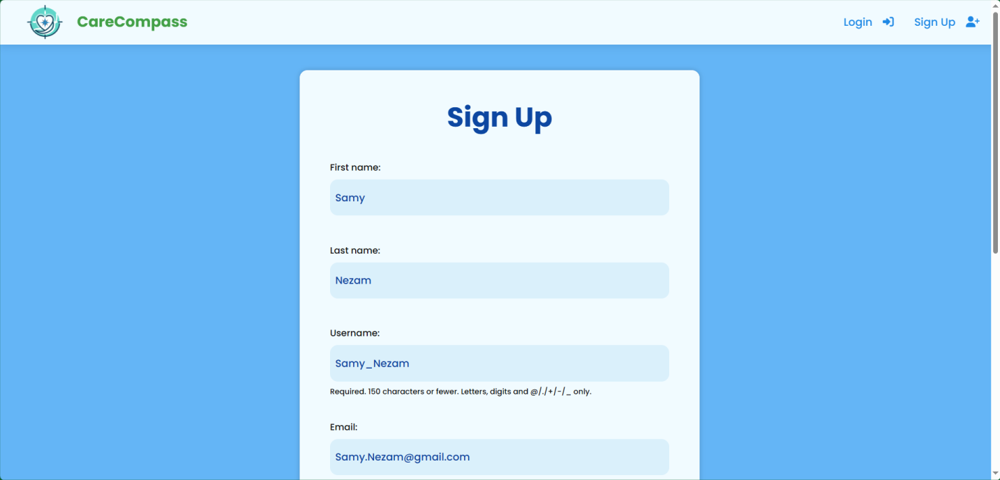
   *Entering personal information in the first step.*

2. **Step 2: Set Up Credentials**
   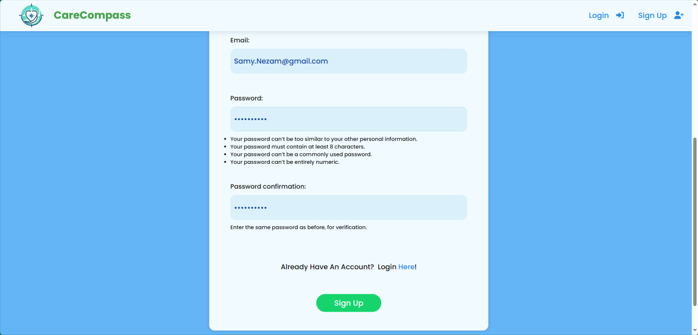
   *Setting up email and password.*

### Login Process

1. **Enter User Credentials To Login**
   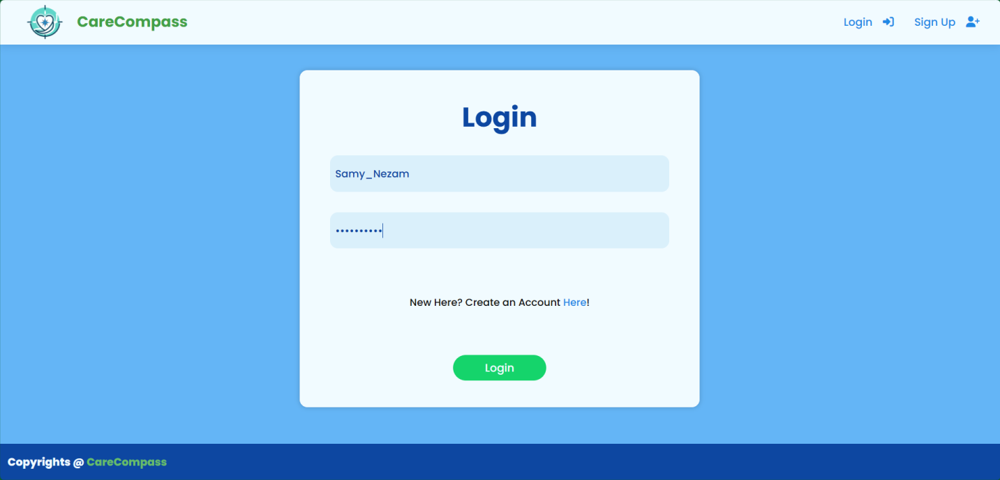
   *Enter username and password to log in and go to the home page.*

### Home Page

1. **Home Page For A Specific User**
   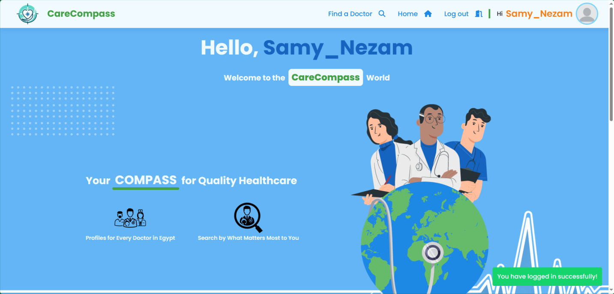
   *View the home page with a welcome message for the logged-in user.*

### Search Process

1. **Initial View:**
   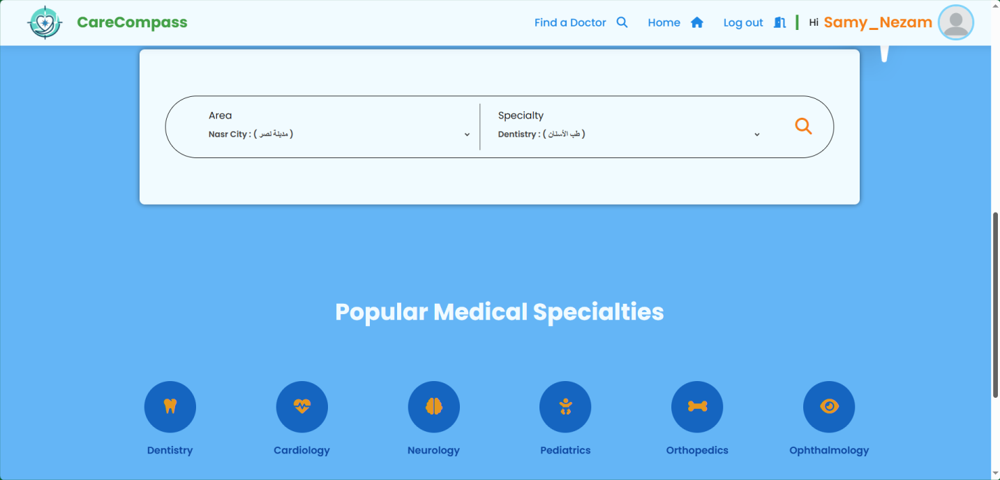
   *This is the initial view before any selections are made.*

2. **Selecting a Location:**
   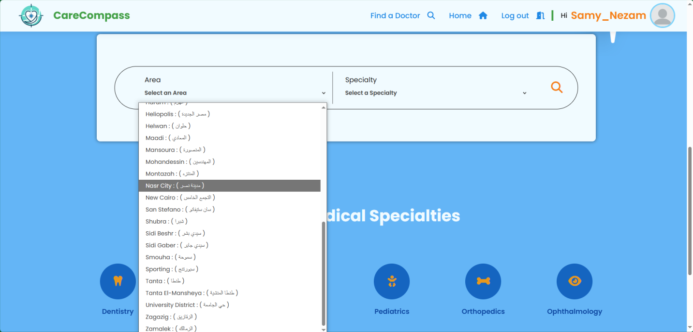
   *Selecting the desired location from the dropdown.*

3. **Selecting a Specialization:**
   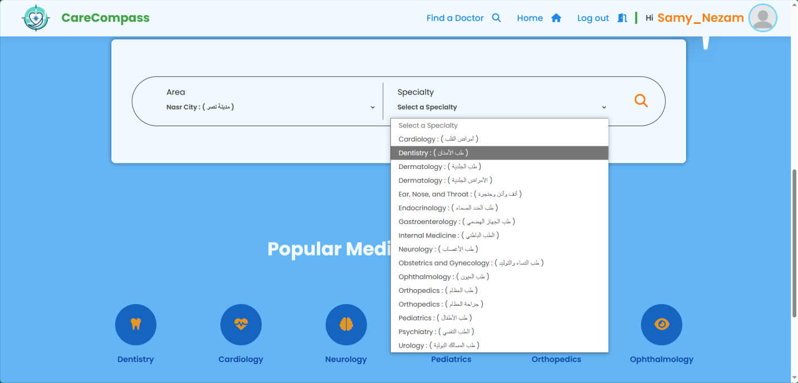
   *Choosing a specialization to refine the search.*

4. **Final View:**
   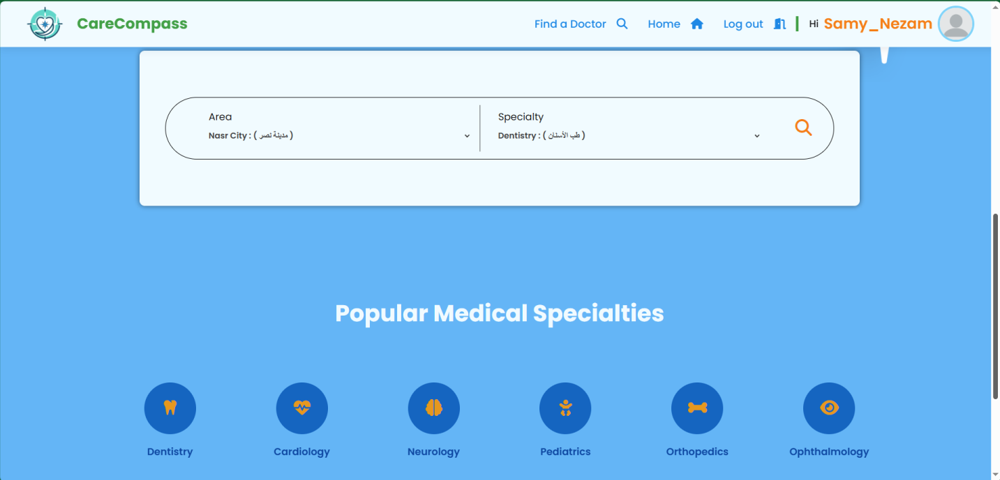
   *The final view shows the search criteria set.*

5. **Search Results:**
   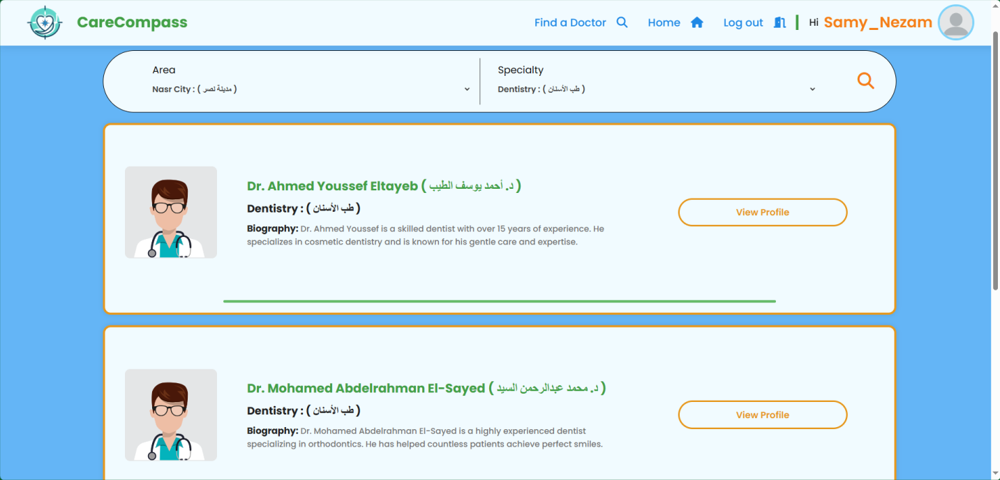
   *Results displayed based on the search criteria.*

### Doctor Profile

1. **Doctor Profile**
   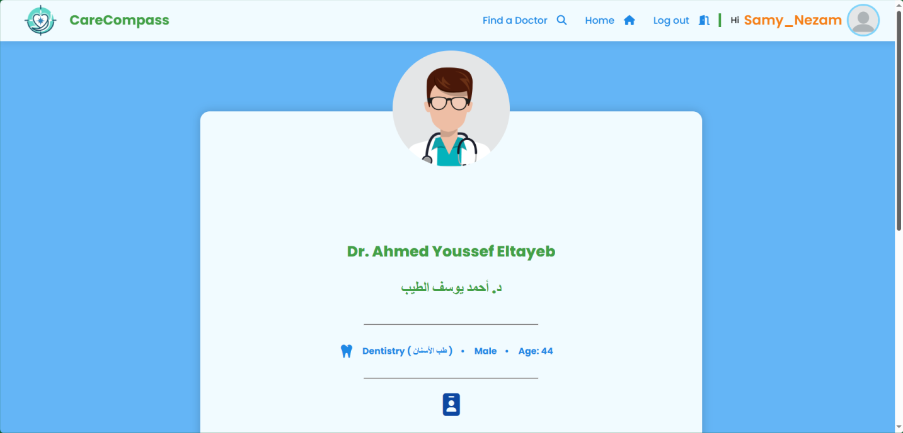
   *Viewing the doctor’s profile personal details.*

2. **Doctor Profile Part 2**
   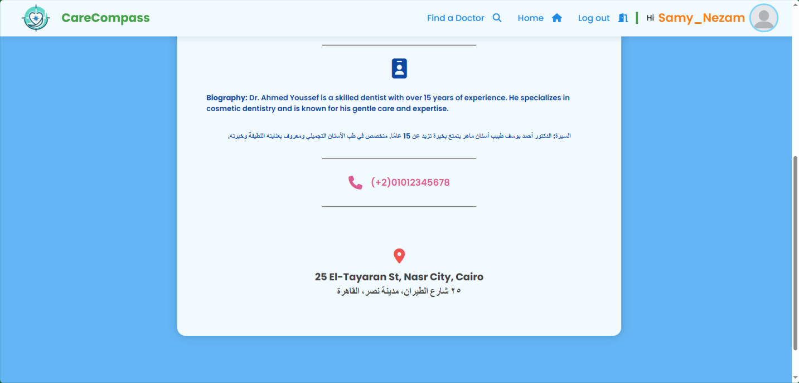
   *Viewing the doctor’s bio and contact info.*
